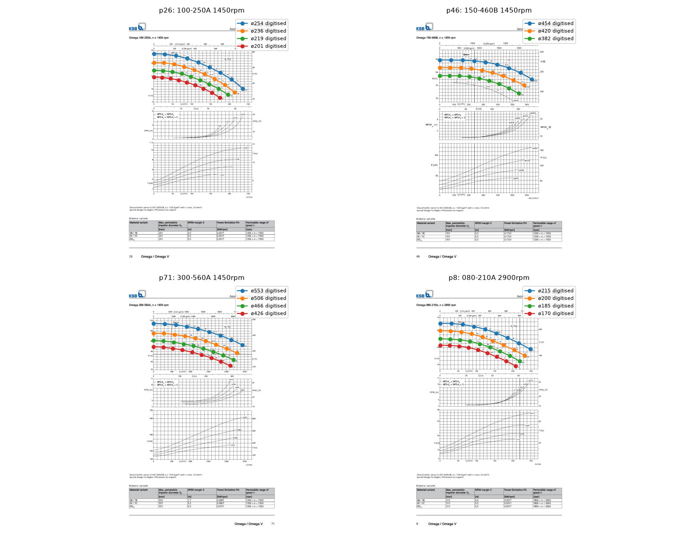
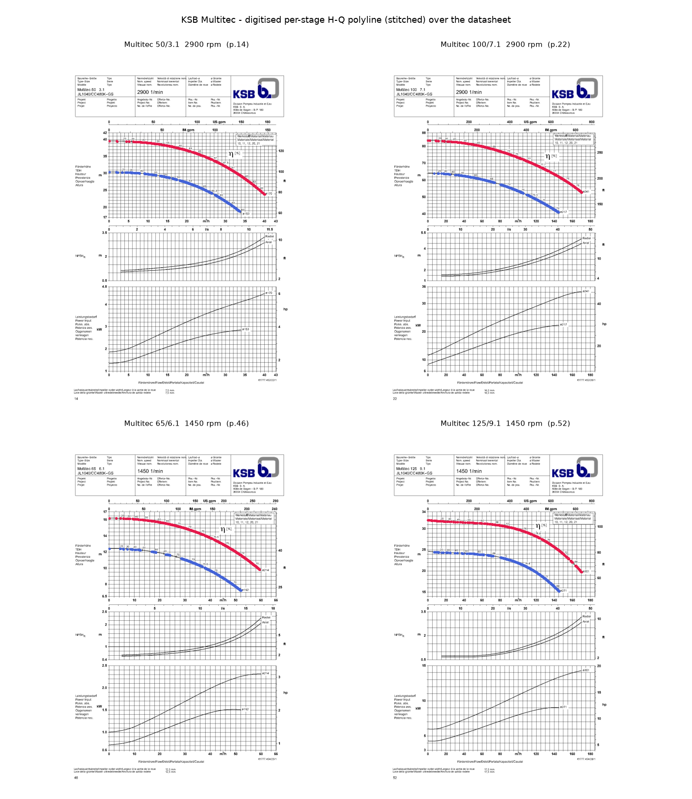

---
---

# The KSB catalogues: how they were made, and how to verify them

Two bundled catalogues are machine-read from KSB's vector datasheet PDFs:
`ksb_omega_50hz.yaml` (single-stage, `tools/digitise_ksb_omega.py`) and
`ksb_multitec_50hz.yaml` (multistage, `tools/digitise_ksb_multitec.py`). Both
carry `digitised: true` and **`verified: false`**.

## Omega — single-stage

`src/pumpsizer/data/catalog/ksb_omega_50hz.yaml` is generated by
`tools/digitise_ksb_omega.py` from `dow-omega-data.pdf` (KSB *Omega / Omega V
50 Hz Characteristic Curves Booklet*, 15.02.2016).

That PDF is **vector graphics** — every H-Q, NPSH and power curve is a stroked
polyline and every axis tick is positioned text — so the curves can be read
back as data rather than eyeballed. For each size page the script:

1. calibrates the shared **Q axis** from the `Q [m³/h]` tick row (linear fit,
   R² > 0.999 required);
2. finds the three stacked charts (**H**, **NPSH**, **P**) from the repeated
   tick rows, and calibrates each value axis from its left-margin numeric ticks;
3. classifies the curve polylines by which chart band they sit in, maps
   **every impeller diameter**'s H-Q and NPSH curves through the calibration
   (one catalogue entry per ø, its name carrying the diameter);
4. reads each impeller's **BEP** from its printed efficiency figure (e.g.
   `82.1`) and x-position → `(q_bep_lps, eff_bep_pct)`;
5. runs sanity checks (Q ascending, H descending, shut-off/runout ratio in
   1.03–2.7). A page that fails is skipped, not guessed.

Result: **246 curves from 73 of 74 size pages** (one skipped), each with a real
`curve: {q_lps, h_m}`, `npshr_points` and a BEP.

## Confidence

The digitisation is good to roughly the width of the printed line — a few
percent on H, a bit more on NPSH (its axis has fewer ticks). It is a
**shortlisting** dataset. Selection flags every digitised candidate with
"curve machine-digitised — confirm against datasheet p.N" and applies a small
score penalty so a hand-verified pump always ranks above it.

**Spot check.** The digitised H-Q points were overlaid on the rendered
datasheet pages 8, 26, 46 and 71 (all four impellers each) — they sit on the
printed curves within plotting tolerance:



The affinity families also agree: for a given size, `H ∝ n²` between the 1450
and 2900 rpm pages and `H ∝ D²` between impeller steps.

## Verifying / correcting an entry you intend to use

1. Open the booklet page in `datasheet_page`.
2. Compare the entry's `curve.q_lps` / `curve.h_m` (and `npshr_points`,
   `eff_bep_pct`) against the printed curve for the impeller diameter you'll
   specify. Nudge any point that's off.
3. Add real efficiency points if you want them:
   ```yaml
   efficiency_points:
     flow_lps: [ ., ., ., ., . ]
     value_pct: [ ., ., ., ., . ]
   ```
4. Set `verified: true` (after a second check) and update `source`.

There is one entry per impeller diameter on the page (`model: "<size> ø<dia>"`);
the two diameters printed on a Multitec page likewise become two entries.

### Working through the whole catalogue

`pumpsizer catalog-verify` shows how many entries are still `verified: false`,
by series. `--emit checklist.csv` writes one row per unverified entry with its
`datasheet_page`, digitised shut-off head, BEP `(Q, η)`, NPSHr at BEP and the
worst `catalog-check` level, plus empty `verdict` / `checked_by` /
`checked_date` / `notes` columns:

```bash
pumpsizer catalog-verify                       # status by series
pumpsizer catalog-verify --emit checklist.csv  # the to-do list
```

Work down the CSV with the booklet open — `tools/verify_ksb_multitec.py
<pdf> --pages 38,40` (or the Omega overlay) renders any page with the
digitised polyline on top. Mark each row `ok` / `corrected` / `reject`, then
set `verified: true` on the `ok` entries in the YAML (a one-word edit; the
tool deliberately doesn't rewrite the generated files for you).

## Multitec — multistage

`ksb_multitec_50hz.yaml` comes from `dow-multitec-data.pdf` the same way, with
two wrinkles handled by `tools/digitise_ksb_multitec.py`:

* **The head axis is per stage.** A Multitec runs *N* equal stages, so total
  head = *N* × the printed curve. **Table 9** (page 9) gives the maximum stage
  count with no balancing drum, per size and speed; the tool parses it and
  stores `stages_max` plus the per-stage curve in `per_stage_head_m`.
  `curve.h_m` is the per-stage head × `stages_max` (the tallest build).
* **The H-Q curve is drawn in fragments**, broken where efficiency contours
  cross it. The tool stitches polyline segments back together by x-adjacency
  and y-continuity before classifying them.

`PumpModel.to_pump_curve(stages=n)` rebuilds the head curve for any stack
height (efficiency and NPSHr are set by one impeller and don't scale), and
`selection` tries `1..stages_max`, picking the **shortest stack that clears the
duty head** — reported as `"n of max m stages"`.

Result: **45 curves** (DN32–DN100 at 2900 and 1450 rpm, DN125/DN150 at 1450 rpm
— the DN125/DN150 2900 rpm columns are `--` in Table 9, i.e. not rated).
Worked example: `examples/high_head_booster_ksb_multitec.yaml`.

**Cross-check.** For the largest impeller, per-stage `H₀ × stages_max` is
compared with Table 9's published maximum head: it agrees to within ~4% for
DN32–DN125, but reads 10–15% off for the two DN150 sizes (a less clean H axis on
those pages). Entries more than 6% off carry a `NOTE:` in the YAML and a
`table9_delta_pct` field. The 2900 / 1450 rpm per-stage `H₀` ratio is 3.9–4.1
(ideal 4.0).

**Spot-check.** `tools/verify_ksb_multitec.py` renders four pages and overlays
the stitched H-Q polyline (`docs/ksb_multitec_verification.png`): the digitised
points sit on the printed per-stage curves for both impellers, with no visible
seam where the fragments were rejoined.



## Machine QA — `pumpsizer catalog-check`

```bash
pumpsizer catalog-check                 # bundled KSB Omega + Multitec
pumpsizer catalog-check --catalogue my_catalogue/ --show-ok --json qa.json
```

`pumpsizer.catalog_qa.check_catalog` runs, for every entry:

* **shape** — Q ascending, H descending, shut-off/run-out ratio 1.03–3.0, BEP
  flow inside the curve, NPSHr in 0.1–25 m and not falling with flow;
* **multistage** — `curve.h_m` equals `per_stage_head_m × stages_max`, and (KSB
  Multitec) that shut-off is within 12 % of Table 9's `hmax`;
* **affinity** — where one pump appears at two speeds or two impeller
  diameters, the per-stage shut-off heads scale as `n²` / `D²`
  (`OK` ≤ 12 % / 18 %, `WARN` beyond, `FAIL` past 25 % / 35 %).

Findings are `OK` / `WARN` / `FAIL`; the command exits non-zero on any `FAIL`
(`--no-fail` to report only). The shipped catalogues have **no FAILs**; the
handful of WARNs (a few Omega BEP x-positions landing just past the last curve
point, one size's 2900 rpm curve ~18 % above `n²`) are the entries to eyeball
first if you're about to rely on them.

## Regenerating

```bash
py tools/digitise_ksb_omega.py    path/to/dow-omega-data.pdf
py tools/digitise_ksb_multitec.py path/to/dow-multitec-data.pdf
py tools/verify_ksb_multitec.py   path/to/dow-multitec-data.pdf   # overlay PNG
```

Re-run after an updated booklet; then re-verify the entries you rely on.
